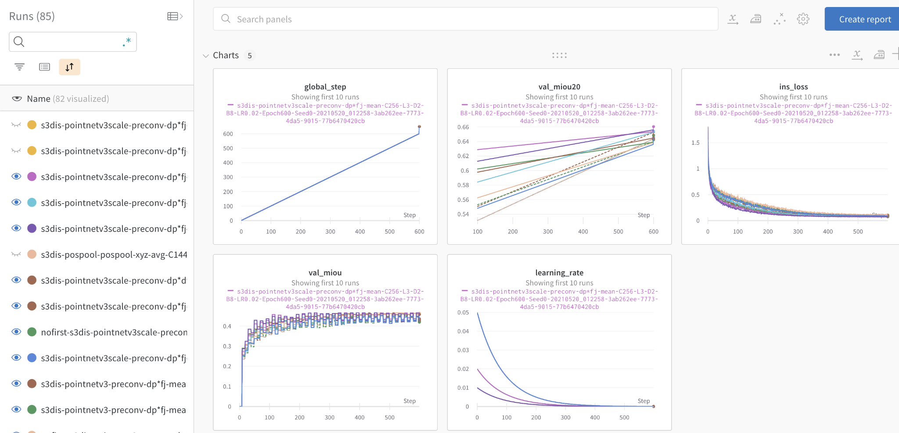
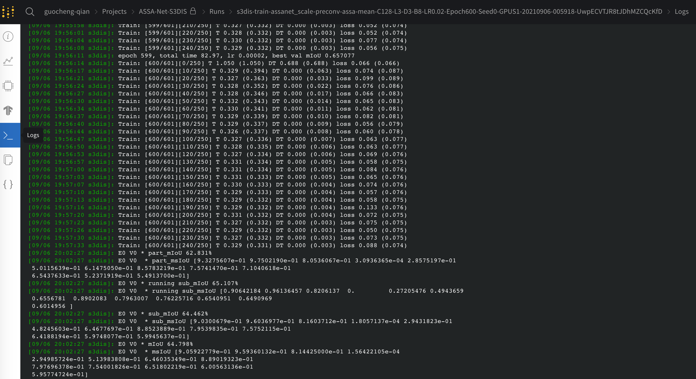
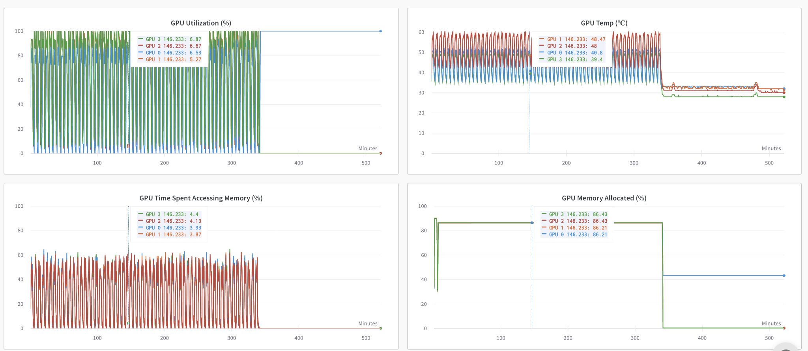
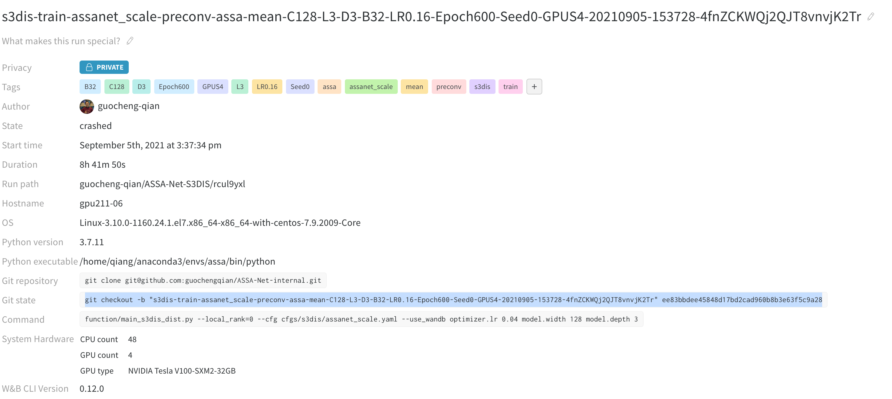
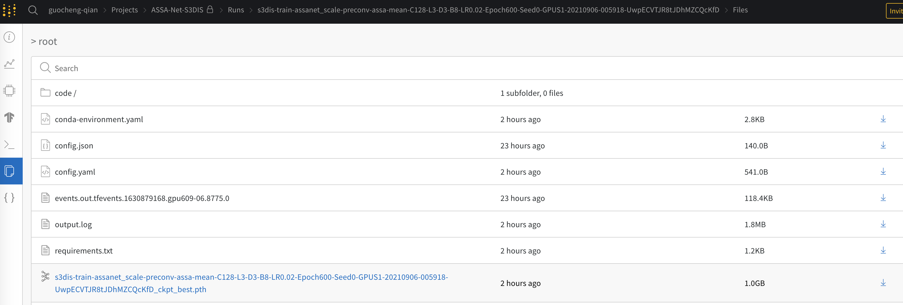
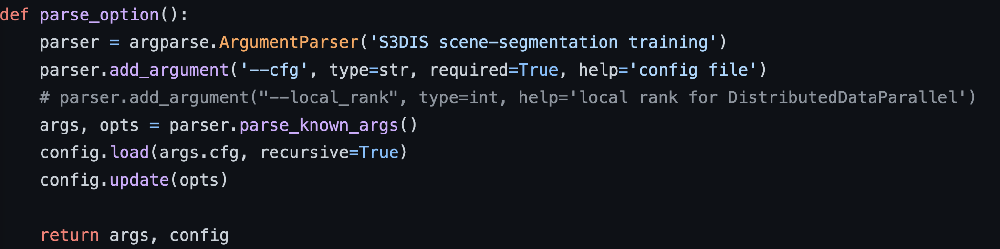
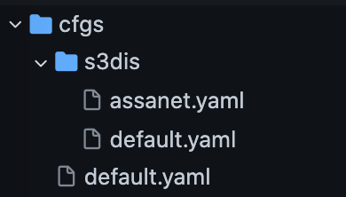

# Organize your experiments using YAML and wandb: a Tutorial

## Install 
```
source init.sh
```

## Why wandb

1. **online Tensorboard**, check your results in running on different machines anytime anywhere through a single website

   

   

2. **Monitor the resourse usage easily.** Such thing is automatically supported by wandb. 

   

3. retrieve the code easily (git checkout) 

   

4. download the checkpoint file or anyfile you saved before online

   


## Why YAML

1. clean the arguments **(just need one line of argument!** )

   

2. Easy hyper-parameters configuration (a hierachical organization)

   

3. human readable, and automatically supports desired data types 

   ```yaml
   model:  # an object called model.
     name: assanet # ASSA-Net. THIS IS HOW YOU COMMENT BY #
     width: 0
     depth: 2  # you can access this value by: model.depth
     in_channel: 4
     activation:
       type: &type ReLU  # you can use ampersand to anchor one variable
     sa_config:
       # *YAML will take care of the data type by itself*
       npoints: [4096, 1152, 304, 88]  # a list of int
       radius: [[0.1, 0.2], [0.2, 0.4], [0.4, 0.8], [0.8, 1.6]]  # a list of float list.
       nsample: [[16, 32], [16, 32], [16, 32], [16, 32]] # a list of int list
       sample_method: fps
       mlps: [[[16, 16, 32], [32, 32, 64]],
              [[64, 64, 128], [64, 96, 128]],
              [[128, 196, 256], [128, 196, 256]],
              [[256, 256, 512], [256, 384, 512]]]
       local_aggregation:
         feature_type: assa  # this is a string
         reduction: "mean" # this is also a string
         type: 'preconv' # this is also a string
         pre_res: True # residual connetion in PreConv layer. this is a Bool type
         post_res: True  # residual connetion in PostConv layer
         layers: 3   # layers = layers of PreConv (before aggregation) + layers of PostConv (after aggregation)
         post_layers: 1  # number of PostConv layers
         grouper:
           method: ball_query
           normalize_xyz: True
         conv:
           method: conv1d
           use_bn: True
           activation:
              type: *type # in this way, you can make the value of this variable to be the same as the anchor value
   ```

4. Easily change the default parameters, e.g.: 

   ```
   python function/main_s3dis_dist.py  --cfg cfgs/s3dis/assanet.yaml optimizer.lr 0.02 model.width 128 model.depth 3
   ```


## How to use YAML

1. Write the general default.yaml for all the experiments

   ```yaml
   local_rank: 0
   
   load_path: null # none
   rng_seed: 0
   mode: train # or test
   
   logname: null # none
   expname: null
   expid: null
   
   wandb:
     use_wandb: False
     project: ASSA-Net  # name of the wandb project
     entity: null
   ```

2. write a `default.yaml` for experiments for the given dataset

   ```yaml
   # ---------------------------------------------------------------------------- #
   # data augmentation
   # ---------------------------------------------------------------------------- #
   data:
     datasets: 's3dis'
     data_root: './data'
     input_features_dim: 4
     num_classes: 13
     num_points: 15000
     in_radius: 2.0
     x_angle_range: 0.0
     y_angle_range: 0.0
     z_angle_range: 3.1415926
     scale_low: 0.7
     scale_high: 1.3
     noise_std: 0.001
     noise_clip: 0.05
     translate_range: 0.0
     color_drop: 0.2
     augment_symmetries:
       - 1
       - 0
       - 0
     sampleDl: 0.04
     num_steps: 2000  # number of spheres for one training epoch.
   
   
   
   # ---------------------------------------------------------------------------- #
   # Training options
   # ---------------------------------------------------------------------------- #
   batch_size: 8 # batch size Per GPU
   num_workers: 6
   
   print_freq: 10
   save_freq: 100
   val_freq: 10
   
   epochs: 600
   start_epoch: 1
   warmup_epoch:  -1
   
   lr_scheduler:
     name: 'step'  # step,cosine
     decay_steps: 1
     decay_rate: 0.9885531
     on_epoch: True
   
   optimizer:
     name: 'sgd'
     weight_decay: 0.001
     momentum: 0.98
     lr: 0.01  # for 1 GPU and batch size 8. have to manually change when increase the number of GPUs or Batch size.
   
   # ---------------------------------------------------------------------------- #
   # logging
   # ---------------------------------------------------------------------------- #
   log_dir: './log/s3dis'
   wandb:
     project: tutorial-yaml-wandb  # name of the wandb project
     entity: guocheng-qian  # *will automatically merge with the parent yaml*
   ```

3. write the specific configuration file for a mode/experiment, e.g., `cfgs/s3dis/assanet.yaml` 

   

## How to use wandb 

Please check `yaml_wandb_example.py` for details, basically you do the following: 

1. first, create an account in [wandb](https://wandb.ai/site), and install the environment

2. add three lines in main file (eg. **yaml_wandb_example.py**): 

   ```
   from utils.wandb Wandb
   
   Wandb.launch(config, config.wandb.use_wandb)
   summary_writer = SummaryWriter(log_dir=config.log_dir)
   ```

3. the main part in `utils.wandb.py` file (which you do not have to change normally) is just one line of code. 

   ```
   wandb.init(**wandb_args, sync_tensorboard=True)  # this is the core command to init wandb. It sync everything of tensorboard and logging output to wandb
   ```

4. save any file you want simply by:

   ```
   Wandb.savefile(path/to/your/file)
   ```


5. run the main file by: 

   ```
   python yaml_wandb_example.py --cfg cfgs/s3dis/assanet.yaml wandb.entity xxxxx wandb.use_wandb True
   ```
   xxxx is your wandb account

6. now, go to your project page in wandb, you should be able to see this run of your experiment


## An example 

```
python yaml_wandb_example.py wandb.entity xxxxx wandb.use_wandb True
```


## Other materials for further reading

1. [YAML tutorial on Youtube](https://www.youtube.com/watch?v=cdLNKUoMc6c&ab_channel=MikeDane)

2. [wandb for PyTorch Tutorial](https://www.youtube.com/watch?v=G7GH0SeNBMA&ab_channel=Weights%26Biases )

3. The official documents

   
